**Links:** {[[Технопарк - дневник]]} {[[../../Main ьфшт|Main]]} {[[]]} {[[]]}
**URL:**  https://emanual.robotis.com/docs/en/dxl/x/xl430-w250/#specifications

# DYNAMIXEL XL430-W250-T datasheet
___

[Edit on GitHub](https://github.com/ROBOTIS-GIT/emanual/blob/master/docs/en/dxl/x/xl430-w250.md)

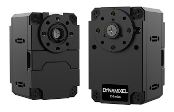

> New XL430-W250 (Released on 2018 3rd quarter)

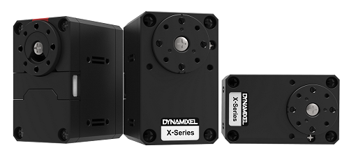

> Old XL430-W250 (This type has been discontinued)

## [Specifications](#specifications)

| Item                   | Specifications                                                                                                                                           |
| ---------------------- | -------------------------------------------------------------------------------------------------------------------------------------------------------- |
| MCU                    | ARM CORTEX-M3 (72 \[MHz\], 32Bit)                                                                                                                        |
| Position Sensor        | Contactless absolute encoder (12Bit, 360 \[°\]) Maker : ams(www.ams.com), Part No : AS5601                                                            |
| Motor                  | Cored                                                                                                                                                    |
| Baud Rate              | 9,600 \[bps\] ~ 4.5 \[Mbps\]                                                                                                                             |
| Control Algorithm      | PID control                                                                                                                                              |
| Resolution             | 4096 \[pulse/rev\]                                                                                                                                       |
| Operating Modes        | Velocity Control Mode Position Control Mode (0 ~ 360 \[°\]) Extended Position Control Mode (Multi-turn) PWM Control Mode (Voltage Control Mode) |
| Weight                 | 57.2 \[g\]                                                                                                                                               |
| Dimensions (W x H x D) | 28.5 x 46.5 x 34 \[mm\]                                                                                                                                  |
| Gear Ratio             | 258.5 : 1                                                                                                                                                |
| Stall Torque           | 1.0 \[N.m\] (at 9.0 \[V\], 1.0 \[A\]) **1.4 \[N.m\] (at 11.1 \[V\], 1.3 \[A\])** 1.5 \[N.m\] (at 12.0 \[V\], 1.4 \[A\])                            |
| No Load Speed          | 47 \[rev/min\] (at 9.0 \[V\]) **57 \[rev/min\] (at 11.1 \[V\])** 61 \[rev/min\] (at 12.0 \[V\])                                                    |
| Operating Temperature  | -5 ~ +72 \[°C\]                                                                                                                                          |
| Input Voltage          | 6.5 ~ 12.0 \[V\] (**Recommended : 11.1 \[V\]**)                                                                                                          |
| Command Signal         | Digital Packet                                                                                                                                           |
| Physical Connection    | TTL Multidrop Bus (5V Logic) TTL Half Duplex Asynchronous Serial Communication (8bit, 1stop, No Parity)                                            |
| ID                     | 253 ID (0 ~ 252)                                                                                                                                         |
| Feedback               | Position, Velocity, Load, Realtime tick, Trajectory, Temperature, Input Voltage, etc                                                                     |
| Case Material          | Engineering Plastic                                                                                                                                      |
| Gear Material          | Engineering Plastic                                                                                                                                      |
| Standby Current        | 52 \[mA\]                                                                                                                                                |

**DANGER**
(May cause serious injury or death)
- Never place items containing water, flammables, and solvents near product.
- Never place fingers, arms, toes, and other body parts near product during operation.
- Cut power off if product emits strange odors or smoke.
- Keep product out of reach of children.
- Check the power’s polarity before wiring.

**CAUTION**
(May cause injury or damage to product)
- Do not operate the product at a temperature exceeding -5 ~ +72 \[°C\] range.
- Do not insert sharp blades nor pins during product operation.

**ATTENTION**
(May cause injury or damage to product)
- Do not disassemble or modify product.
- Do not drop or apply strong shock to product.

## [Performance Graph](#performance-graph)

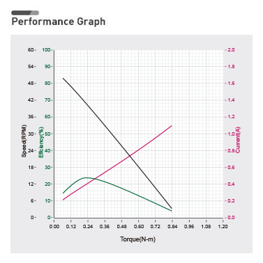

  **Looking for the same form factors?**

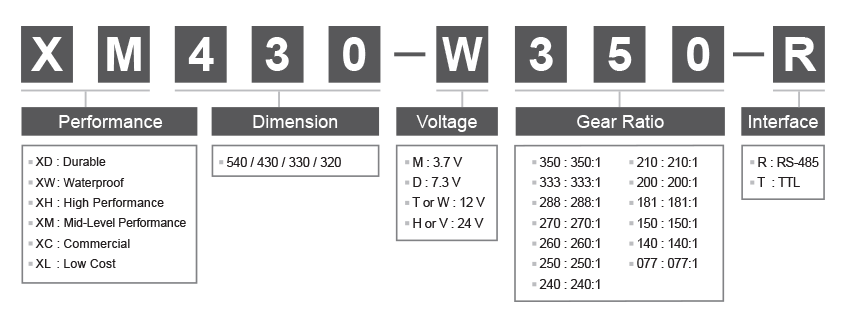

## [XW430](#xw430)
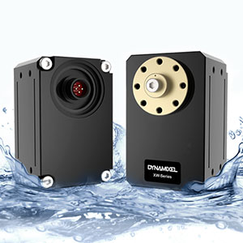

| Model | Stall Torque | No-Load Speed |
| --- | --- | --- |
| [XW430-T333-R](https://emanual.robotis.com/docs/en/dxl/x/xw430-t333/) | 2.9 \[N.m\] (at 11.1 \[V\], 1.2 \[A\]) 3.1 \[N.m\] (at 12.0 \[V\], 1.3 \[A\]) 3.6 \[N.m\] (at 14.8 \[V\], 1.5 \[A\]) | 29 \[rev/min\] (at 11.1 \[V\] 31 \[rev/min\] (at 12.0 \[V\] 39 \[rev/min\] (at 14.8 \[V\]) |
| [XW430-T200-R](https://emanual.robotis.com/docs/en/dxl/x/xw430-t200/) | 6.4 \[N.m\] (at 11.1 \[V\], 4.5 \[A\]) 6.9 \[N.m\] (at 12.0 \[V\], 4.9 \[A\]) 8.3 \[N.m\] (at 14.8 \[V\], 5.9 \[A\]) | 49 \[rev/min\] (at 11.1 \[V\] 53 \[rev/min\] (at 12.0 \[V\] 66 \[rev/min\] (at 14.8 \[V\]) |

## [XD430](#xd430)

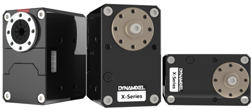

| Model | Stall Torque | No-Load Speed |
| --- | --- | --- |
| [XD430-T350-R](https://emanual.robotis.com/docs/en/dxl/x/xd430-t350) | 3.1 \[N.m\] (at 11.1 \[V\], 1.2 \[A\]) 3.4 \[N.m\] (at 12.0 \[V\], 1.3 \[A\]) 4.2 \[N.m\] (at 14.8 \[V\], 1.5 \[A\]) | 27 \[rev/min\] (at 11.1 \[V\]) 30 \[rev/min\] (at 12.0 \[V\]) 37 \[rev/min\] (at 14.8 \[V\]) |
| [XD430-T210-R](https://emanual.robotis.com/docs/en/dxl/x/xd430-t210) | 2.2 \[N.m\] (at 11.1 \[V\], 1.2 \[A\]) 2.5 \[N.m\] (at 12.0 \[V\], 1.3 \[A\]) 3.1 \[N.m\] (at 14.8 \[V\], 1.5 \[A\]) | 46 \[rev/min\] (at 11.1 \[V\]) 50 \[rev/min\] (at 12.0 \[V\]) 62 \[rev/min\] (at 14.8 \[V\]) |

## [XH430](#xh430)

| Model | Stall Torque | No-Load Speed |
| --- | --- | --- |
| [XH430-V350-R](https://emanual.robotis.com/docs/en/dxl/x/xh430-v350/) | 3.3 \[N.m\] (at 24 \[V\], 0.7\[A\]) | 31 \[rev/min\] (at 24 \[V\]) |
| [XH430-W350-T/R](https://emanual.robotis.com/docs/en/dxl/x/xh430-w350/) | 3.1 \[N.m\] (at 11.1 \[V\], 1.2 \[A\]) 3.4 \[N.m\] (at 12.0 \[V\], 1.3 \[A\]) 4.2 \[N.m\] (at 14.8 \[V\], 1.5 \[A\]) | 27 \[rev/min\] (at 11.1 \[V\]) 30 \[rev/min\] (at 12.0 \[V\]) 37 \[rev/min\] (at 14.8 \[V\]) |
| [XH430-V210-R](https://emanual.robotis.com/docs/en/dxl/x/xh430-v210/) | 2.6 \[N.m\] (at 24 \[V\], 0.7\[A\]) | 52 \[rev/min\] (at 24 \[V\]) |
| [XH430-W210-T/R](https://emanual.robotis.com/docs/en/dxl/x/xh430-w210/) | 2.2 \[N.m\] (at 11.1 \[V\], 1.2 \[A\]) 2.5 \[N.m\] (at 12.0 \[V\], 1.3 \[A\]) 3.1 \[N.m\] (at 14.8 \[V\], 1.5 \[A\]) | 46 \[rev/min\] (at 11.1 \[V\]) 50 \[rev/min\] (at 12.0 \[V\]) 62 \[rev/min\] (at 14.8 \[V\]) |

## [XM430](#xm430)

| Model | Stall Torque | No-Load Speed |
| --- | --- | --- |
| [XM430-W350-T/R](https://emanual.robotis.com/docs/en/dxl/x/xm430-w350/) | 3.8 \[N.m\] (at 11.1 \[V\], 2.1 \[A\]) 4.1 \[N.m\] (at 12.0 \[V\], 2.3 \[A\]) 4.8 \[N.m\] (at 14.8 \[V\], 2.7 \[A\]) | 43 \[rev/min\] (at 11.1 \[V\]) 46 \[rev/min\] (at 12.0 \[V\]) 57 \[rev/min\] (at 14.8 \[V\]) |
| [XM430-W210-T/R](https://emanual.robotis.com/docs/en/dxl/x/xm430-w210/) | 2.7 \[N.m\] (at 11.1 \[V\], 2.1 \[A\]) 3.0 \[N.m\] (at 12.0 \[V\], 2.3 \[A\]) 3.7 \[N.m\] (at 14.8 \[V\], 2.7 \[A\]) | 70 \[rev/min\] (at 11.1 \[V\]) 77 \[rev/min\] (at 12.0 \[V\]) 95 \[rev/min\] (at 14.8 \[V\]) |

## [XC430](#xc430)

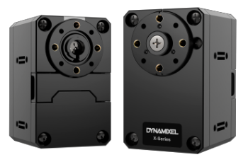

| Model | Stall Torque | No-Load Speed |
| --- | --- | --- |
| [XC430-W240-T](https://emanual.robotis.com/docs/en/dxl/x/xc430-w240/) | 1.4 \[N.m\] (at 9.0 \[V\], 1.1 \[A\]) 1.7 \[N.m\] (at 11.1 \[V\], 1.3 \[A\]) 1.9 \[N.m\] (at 12.0 \[V\], 1.4 \[A\]) | 52 \[rev/min\] (at 9.0 \[V\]) 65 \[rev/min\] (at 11.1 \[V\]) 70 \[rev/min\] (at 12.0 \[V\]) |
| [XC430-W150-T](https://emanual.robotis.com/docs/en/dxl/x/xc430-w150/) | 1.2 \[N.m\] (at 9.0 \[V\], 1.1 \[A\]) 1.4 \[N.m\] (at 11.1 \[V\], 1.3 \[A\]) 1.6 \[N.m\] (at 12.0 \[V\], 1.4 \[A\]) | 80 \[rev/min\] (at 9.0 \[V\]) 99 \[rev/min\] (at 11.1 \[V\]) 106 \[rev/min\] (at 12.0 \[V\]) |

## [XL430](#xl430)

| Model | Stall Torque | No-Load Speed |
| --- | --- | --- |
| [XL430-W250-T](https://emanual.robotis.com/docs/en/dxl/x/xl430-w250/) | 1.0 \[N.m\] (at 9.0 \[V\], 1.0 \[A\]) 1.4 \[N.m\] (at 11.1 \[V\], 1.3 \[A\]) 1.5 \[N.m\] (at 12.0 \[V\], 1.4 \[A\]) | 47 \[rev/min\] (at 9.0 \[V\]) 57 \[rev/min\] (at 11.1 \[V\]) 61 \[rev/min\] (at 12.0 \[V\]) |

**NOTE** : The Max Torque and the Stall Torque of Performance Graph are different in measurement methods. Stall torque is a measured value of the momentary torque that it can reach. This is generally how RC servos are measured. The Performance graph is also called as N-T curves, which is measured with the gradually increasing load. The actual motor operation environment is closer to the performance graph, not stall torque method. For this reason, the performance graph is broadly used in the industrial field. Generally, Max Torque of the Performance Graph is less than the Stall Torque.

**CAUTION : When supplying power**

- It is recommended using ROBOTIS controller or SMPS2DYNAMIXEL.
    
- Do not connect or disconnect DYNAMIXEL when power is being supplied.
    

## [Control Table](#control-table)

The Control Table is a structure of data implemented in the device. Users can read a specific Data to get status of the device with Read Instruction Packets, and modify Data as well to control the device with WRITE Instruction Packets.

## [Control Table, Data, Address](#control-table-data-address)

The Control Table is a structure that consists of multiple Data fields to store status or to control the device. Users can check current status of the device by reading a specific Data from the Control Table with Read Instruction Packets. WRITE Instruction Packets enable users to control the device by changing specific Data in the Control Table. The Address is a unique value when accessing a specific Data in the Control Table with Instruction Packets. In order to read or write data, users must designate a specific Address in the Instruction Packet. Please refer to [DYNAMIXEL Protocol 2.0](https://emanual.robotis.com/docs/en/dxl/protocol2/) for more details about Instruction Packets.

**NOTE** : Two’s complement is applied for the negative value. For more information, please refer to [Two’s complement](https://en.wikipedia.org/wiki/Two%27s_complement) from Wikipedia.

### [Area (EEPROM, RAM)](#area-eeprom-ram)

The Control Table is divided into 2 Areas. Data in the RAM Area is reset to initial values when the power is reset(Volatile). On the other hand, data in the EEPROM Area is maintained even when the device is powered off(Non-Volatile).

**Data in the EEPROM Area can only be written to if Torque Enable(64) is cleared to ‘0’(Torque OFF).**

### [Size](#size)

The Size of data varies from 1 ~ 4 bytes depend on their usage. Please check the size of data when updating the data with an Instruction Packet. For data larger than 2 bytes will be saved according to [Little Endian](https://en.wikipedia.org/wiki/Endianness#Little).

### [Access](#access)

The Control Table has two different access properties. ‘RW’ property stands for read and write access permission while ‘R’ stands for read only access permission. Data with the read only property cannot be changed by the WRITE Instruction. Read only property(‘R’) is generally used for measuring and monitoring purpose, and read write property(‘RW’) is used for controlling device.

### [Initial Value](#initial-value)

Each data in the Control Table is restored to initial values when the device is turned on. Default values in the EEPROM area are initial values of the device (factory default settings). If any values in the EEPROM area are modified by a user, modified values will be restored as initial values when the device is turned on. Initial Values in the RAM area are restored when the device is turned on.

## [Control Table of EEPROM Area](#control-table-of-eeprom-area)

| Address | Size(Byte) | Data Name | Access | Initial Value | Range | Unit |
| --- | --- | --- | --- | --- | --- | --- |
| 0   | 2   | [Model Number](#model-number) | R   | 1,060 | -   | -   |
| 2   | 4   | [Model Information](#model-information) | R   | -   | -   | -   |
| 6   | 1   | [Firmware Version](#firmware-version) | R   | -   | -   | -   |
| 7   | 1   | [ID](#id) | RW  | 1   | 0 ~ 252 | -   |
| 8   | 1   | [Baud Rate](#baud-rate) | RW  | 1   | 0 ~ 7 | -   |
| 9   | 1   | [Return Delay Time](#return-delay-time) | RW  | 250 | 0 ~ 254 | 2 \[μsec\] |
| 10  | 1   | [Drive Mode](#drive-mode) | RW  | 0   | 0 ~ 5 | -   |
| 11  | 1   | [Operating Mode](#operating-mode) | RW  | 3   | 0 ~ 16 | -   |
| 12  | 1   | [Secondary(Shadow) ID](#secondary-shadow-id) | RW  | 255 | 0 ~ 252 | -   |
| 13  | 1   | [Protocol Type](#protocol-type13) | RW  | 2   | 1 ~ 2 | -   |
| 20  | 4   | [Homing Offset](#homing-offset) | RW  | 0   | -1,044,479 ~ 1,044,479 | 1 \[pulse\] |
| 24  | 4   | [Moving Threshold](#moving-threshold) | RW  | 10  | 0 ~ 1,023 | 0.229 \[rev/min\] |
| 31  | 1   | [Temperature Limit](#temperature-limit) | RW  | 72  | 0 ~ 100 | 1 \[°C\] |
| 32  | 2   | [Max Voltage Limit](#max-voltage-limit) | RW  | 140 | 60 ~ 140 | 0.1 \[V\] |
| 34  | 2   | [Min Voltage Limit](#min-voltage-limit) | RW  | 60  | 60 ~ 140 | 0.1 \[V\] |
| 36  | 2   | [PWM Limit](#pwm-limit) | RW  | 885 | 0 ~ 885 | 0.113 \[%\] |
| 44  | 4   | [Velocity Limit](#velocity-limit) | RW  | 265 | 0 ~ 1,023 | 0.229 \[rev/min\] |
| 48  | 4   | [Max Position Limit](#max-position-limit) | RW  | 4,095 | 0 ~ 4,095 | 1 \[pulse\] |
| 52  | 4   | [Min Position Limit](#min-position-limit) | RW  | 0   | 0 ~ 4,095 | 1 \[pulse\] |
| 60  | 1   | [Startup Configuration](#startup-configuration) | RW  | 0   | 3   | -   |
| 63  | 1   | [Shutdown](#shutdown) | RW  | 52  | -   | -   |

## [Control Table of RAM Area](#control-table-of-ram-area)

| Address | Size(Byte) | Data Name | Access | Initial Value | Range | Unit |
| --- | --- | --- | --- | --- | --- | --- |
| 64  | 1   | [Torque Enable](#torque-enable) | RW  | 0   | 0 ~ 1 | -   |
| 65  | 1   | [LED](#led) | RW  | 0   | 0 ~ 1 | -   |
| 68  | 1   | [Status Return Level](#status-return-level) | RW  | 2   | 0 ~ 2 | -   |
| 69  | 1   | [Registered Instruction](#registered-instruction) | R   | 0   | 0 ~ 1 | -   |
| 70  | 1   | [Hardware Error Status](#hardware-error-status) | R   | 0   | -   | -   |
| 76  | 2   | [Velocity I Gain](#velocity-i-gain) | RW  | 1,000 | 0 ~ 16,383 | -   |
| 78  | 2   | [Velocity P Gain](#velocity-p-gain) | RW  | 100 | 0 ~ 16,383 | -   |
| 80  | 2   | [Position D Gain](#position-d-gain) | RW  | 4,000 | 0 ~ 16,383 | -   |
| 82  | 2   | [Position I Gain](#position-i-gain) | RW  | 0   | 0 ~ 16,383 | -   |
| 84  | 2   | [Position P Gain](#position-p-gain) | RW  | 640 | 0 ~ 16,383 | -   |
| 88  | 2   | [Feedforward 2nd Gain](#feedforward-2nd-gain) | RW  | 0   | 0 ~ 16,383 | -   |
| 90  | 2   | [Feedforward 1st Gain](#feedforward-1st-gain) | RW  | 0   | 0 ~ 16,383 | -   |
| 98  | 1   | [Bus Watchdog](#bus-watchdog) | RW  | 0   | 1 ~ 127 | 20 \[msec\] |
| 100 | 2   | [Goal PWM](#goal-pwm) | RW  | -   | -PWM Limit(36) ~ PWM Limit(36) | 0.113 \[%\] |
| 104 | 4   | [Goal Velocity](#goal-velocity) | RW  | -   | -Velocity Limit(44) ~ Velocity Limit(44) | 0.229 \[rev/min\] |
| 108 | 4   | [Profile Acceleration](#profile-acceleration) | RW  | 0   | 0 ~ 32,767 0 ~ 32,737 | 214.577 \[rev/min2\] 1 \[ms\] |
| 112 | 4   | [Profile Velocity](#profile-velocity) | RW  | 0   | 0 ~ 32,767 | 0.229 \[rev/min\] |
| 116 | 4   | [Goal Position](#goal-position) | RW  | -   | Min Position Limit(52) ~ Max Position Limit(48) | 1 \[pulse\] |
| 120 | 2   | [Realtime Tick](#realtime-tick) | R   | -   | 0 ~ 32,767 | 1 \[msec\] |
| 122 | 1   | [Moving](#moving) | R   | 0   | 0 ~ 1 | -   |
| 123 | 1   | [Moving Status](#moving-status) | R   | 0   | -   | -   |
| 124 | 2   | [Present PWM](#present-pwm) | R   | -   | -   | -   |
| 126 | 2   | [Present Load](#present-load) | R   | -   | -1,000 ~ 1,000 | 0.1 \[%\] |
| 128 | 4   | [Present Velocity](#present-velocity) | R   | -   | -   | 0.229 \[rev/min\] |
| 132 | 4   | [Present Position](#present-position) | R   | -   | -   | 1 \[pulse\] |
| 136 | 4   | [Velocity Trajectory](#velocity-trajectory) | R   | -   | -   | 0.229 \[rev/min\] |
| 140 | 4   | [Position Trajectory](#position-trajectory) | R   | -   | -   | 1 \[pulse\] |
| 144 | 2   | [Present Input Voltage](#present-input-voltage) | R   | -   | -   | 0.1 \[V\] |
| 146 | 1   | [Present Temperature](#present-temperature) | R   | -   | -   | 1 \[°C\] |
| 147 | 1   | [Backup Ready](#backup-ready) | R   | -   | 0 ~ 1 | -   |
| 168 | 2   | [Indirect Address 1](#indirect-address) | RW  | 224 | 64 ~ 661 | -   |
| 170 | 2   | [Indirect Address 2](#indirect-address) | RW  | 225 | 64 ~ 661 | -   |
| 172 | 2   | [Indirect Address 3](#indirect-address) | RW  | 226 | 64 ~ 661 | -   |
| …   | …   | …   | …   | …   | -   | -   |
| 218 | 2   | [Indirect Address 26](#indirect-address) | RW  | 249 | 64 ~ 661 | -   |
| 220 | 2   | [Indirect Address 27](#indirect-address) | RW  | 250 | 64 ~ 661 | -   |
| 222 | 2   | [Indirect Address 28](#indirect-address) | RW  | 251 | 64 ~ 661 | -   |
| 224 | 1   | [Indirect Data 1](#indirect-data) | RW  | 0   | 0 ~ 255 | -   |
| 225 | 1   | [Indirect Data 2](#indirect-data) | RW  | 0   | 0 ~ 255 | -   |
| 226 | 1   | [Indirect Data 3](#indirect-data) | RW  | 0   | 0 ~ 255 | -   |
| …   | …   | …   | …   | …   | -   | -   |
| 249 | 1   | [Indirect Data 26](#indirect-data) | RW  | 0   | 0 ~ 255 | -   |
| 250 | 1   | [Indirect Data 27](#indirect-data) | RW  | 0   | 0 ~ 255 | -   |
| 251 | 1   | [Indirect Data 28](#indirect-data) | RW  | 0   | 0 ~ 255 | -   |
| 578 | 2   | [Indirect Address 29](#indirect-address) | RW  | 634 | 64 ~ 661 | -   |
| 580 | 2   | [Indirect Address 30](#indirect-address) | RW  | 635 | 64 ~ 661 | -   |
| 582 | 2   | [Indirect Address 31](#indirect-address) | RW  | 636 | 64 ~ 661 | -   |
| …   | …   | …   | …   | …   | -   | -   |
| 628 | 2   | [Indirect Address 54](#indirect-address) | RW  | 659 | 64 ~ 661 | -   |
| 630 | 2   | [Indirect Address 55](#indirect-address) | RW  | 660 | 64 ~ 661 | -   |
| 632 | 2   | [Indirect Address 56](#indirect-address) | RW  | 661 | 64 ~ 661 | -   |
| 634 | 1   | [Indirect Data 29](#indirect-data) | RW  | 0   | 0 ~ 255 | -   |
| 635 | 1   | [Indirect Data 30](#indirect-data) | RW  | 0   | 0 ~ 255 | -   |
| 636 | 1   | [Indirect Data 31](#indirect-data) | RW  | 0   | 0 ~ 255 | -   |
| …   | …   | …   | …   | …   | -   | -   |
| 659 | 1   | [Indirect Data 54](#indirect-data) | RW  | 0   | 0 ~ 255 | -   |
| 660 | 1   | [Indirect Data 55](#indirect-data) | RW  | 0   | 0 ~ 255 | -   |
| 661 | 1   | [Indirect Data 56](#indirect-data) | RW  | 0   | 0 ~ 255 | -   |

**CAUTION** : Protocol 1.0 does not support addresses greater than 256. Therefore, Indirect Address 29 ~ 56 and Indirect Data 29 ~ 56 can only be accessed with Protocol 2.0.

## [Control Table Description](#control-table-description)
**CAUTION** : Data in the EEPROM Area can only be written when the value of Torque Enable(64) is cleared to ‘0’.

### **[Model Number(0)](#model-number0)**
This address stores model number of DYNAMIXEL.

### **[Firmware Version(6)](#firmware-version6)**
This address stores firmware version of DYNAMIXEL.

### **[ID(7)](#id7)**
The ID is a unique value in the network to identify each DYNAMIXEL with an Instruction Packet. 0~253 (0xFD) values can be used as an ID, and 254(0xFE) is occupied as a broadcast ID. The Broadcast ID(254, 0xFE) can send an Instruction Packet to all connected DYNAMIXEL simultaneously.

**NOTE** : Please avoid using an identical ID for multiple DYNAMIXEL. You may face communication failure or may not be able to detect DYNAMIXEL with an identical ID.

**NOTE** : If the Instruction Packet ID is set to the Broadcast ID(0xFE), Status Packets will not be returned for READ or WRITE Instructions regardless of the set value of Stuatus Return Level (68). For more details, please refer to the `Status Packet` section for [DYNAMIXEL Protocol 2.0](https://emanual.robotis.com/docs/en/dxl/protocol2/)

### **[Baud Rate(8)](#baud-rate8)**
The Baud Rate(8) determines serial communication speed between a controller and DYNAMIXEL.

| Value | Baud Rate | Margin of Error |
| --- | --- | --- |
| 7   | 4.5M \[bps\] | 0.000 \[%\] |
| 6   | 4M \[bps\] | 0.000 \[%\] |
| 5   | 3M \[bps\] | 0.000 \[%\] |
| 4   | 2M \[bps\] | 0.000 \[%\] |
| 3   | 1M \[bps\] | 0.000 \[%\] |
| 2   | 115,200 \[bps\] | 0.000 \[%\] |
| 1(Default) | 57,600 \[bps\] | 0.000 \[%\] |
| 0   | 9,600 \[bps\] | 0.000 \[%\] |

**NOTE** : Less than 3% of the baud rate error margin will not affect to UART communication.

**NOTE** : For the stable communication with higher Baudrate using U2D2, configure USB Latency value to the lower.
[USB Latency Setting](https://emanual.robotis.com/docs/en/software/dynamixel/dynamixel_wizard2/#usb-latency-setting)

### **[Return Delay Time(9)](#return-delay-time9)**
If the DYNAMIXEL receives an Instruction Packet, it will return the Status Packet after the time of the set Return Delay Time(9).
Note that the range of values is 0 to 254 (0XFE) and its unit is 2 \[μsec\]. For instance, if the Return Delay Time(9) is set to ‘10’, the Status Packet will be returned after 20\[μsec\] when the Instruction Packet is received.

| Unit | Value Range | Description |
| --- | --- | --- |
| 2\[μsec\] | 0 ~ 254 | Default value ‘250’(500\[μsec\]) Maximum value: ‘508’\[μsec\] |

### **[Drive Mode(10)](#drive-mode10)**
The Drive Mode(10) configures Drive Mode of DYNAMIXEL.

| Bit | Item | Description |     |
| --- | --- | --- | --- |
| Bit 7(0x80) | -   | Unused, always ‘0’ |     |
| Bit 6(0x40) | -   | Unused, always ‘0’ |     |
| Bit 5(0x20) | -   | Unused, always ‘0’ |     |
| Bit 4(0x10) | -   | Unused, always ‘0’ |     |
| Bit 3(0x08) | Torque On by Goal Update | **\[0\]** Performing a given command only if the value of [Torque Enable(64)](#torque-enable64) is ‘1’ **\[1\]** Performing a given command regardless of the set value of [Torque Enable(64)](#torque-enable64). If the value of Torque Enable(64) is ‘0’ and the command is given, the Torque Enable(64) switches to ‘1’ and perform the command. |     |
| Bit 2(0x04) | Profile Configuration | **\[0\]** Velocity-based Profile: Create a Profile based on Velocity **\[1\]** Time-based Profile: Create Profile based on time ※ See [What is the Profile](#what-is-the-profile) |     |
| Bit 1(0x02) | -   | Unused, always ‘0’ |     |
| Bit 0(0x01) | Normal/Reverse Mode | **\[0\]** Normal Mode: CCW(Positive), CW(Negative) **\[1\]** Reverse Mode: CCW(Negative), CW(Positive) |     |

**NOTE** : Time-based Profile is available from **firmware V42**.

**NOTE**: Torque On by Goal Update is available from firmware **V45**.

**NOTE** : If the value of Bit 0(Normal/Reverse Mode) of the Drive Mode(10) is set to `1`, rotational direction is inverted.
Thus, **Goal Position**, **Present Position** will have a inverted direction.
This feature can be very useful when configuring symmetrical joint.

### **[Operating Mode(11)](#operating-mode11)**
| Value | Operating Mode | Description |
| --- | --- | --- |
| 1   | Velocity Control Mode (0° ~ 360°) | This mode controls velocity and ideal for wheel operation. This mode is identical to the Wheel Mode(endless) from existing DYNAMIXEL. |
| 3(Default) | Position Control Mode | This mode controls position and identical to the Joint Mode. Operating position range is limited by Max Position Limit(48) and Min Position Limit(52). This mode is ideal for articulated robots that each joint rotates less than 360°. |
| 4   | Extended Position Control Mode (Multi-turn) | This mode controls position and identical to Multi-turn Mode. 512 turns are supported(-256\[rev\] ~ 256\[rev\]) and ideal for multi-turn wrists or conveyer systems or a system that requires an additional reduction gear. |
| 16  | PWM Control Mode (Voltage Control Mode) | This mode directly controls PWM output (Voltage Control Mode) |

**NOTE** : Switching Operating Mode will reset gains(PID, Feedfoward) properly to the selected Operating Mode. The profile generator and limits will also be reset.

1.  [Profile Velocity(112)](#profile-velocity112), [Profile Acceleration(108)](#profile-acceleration108) : Reset to ‘0’
2.  [Goal PWM(100)](#goal-pwm100) : Reset to [PWM Limit(36)](#pwm-limit36)

**NOTE** : PWM is the abbreviation for Pulse Width Modulation that modulates PWM Duty to control motors.
It changes pulse width to control average supply voltage to the motor and this technique is widely used in the motor control field.

1.  PWM Control Mode is similar to the Wheel Mode of DYNAMIXEL [AX](https://emanual.robotis.com/docs/en/dxl/ax/ax-12w/#cw-compliance-margin) and [RX](https://emanual.robotis.com/docs/en/dxl/rx/rx-10/#moving-speed-32) series.
2.  Use [Goal PWM(100)](#goal-pwm100) on PWM Control Mode in order to control supply voltage for DYNAMIXEL.

**NOTE** : [Present Position(132)](#present-position) represents 4 byte continuous range from -2,147,483,648 to 2,147,483,647 when Torque is turned off regardless of Operating Mode(11).
However, [Present Position(132)](#present-position) will be reset to an absolute position value within one full rotation in following cases. Note that [Present Position(132)](#present-position) value that is reset to an absolute value can differ by the set [Homing Offset(20)](#homing-offset) value.:
1.  When Operating Mode(11) switches to **Position Control Mode**, [Present Position(132)](#present-position) will be reset to an absolute position value within a full rotation.
2.  When torque is turned on in **Position Control Mode**, [Present Position(132)](#present-position) will be reset to an absolute position value within one full rotation.
3.  Turning on the power supply or using [Reboot Instruction](https://emanual.robotis.com/docs/en/dxl/protocol2/#reboot).

### **[Secondary(Shadow) ID(12)](#secondaryshadow-id12)**
The Secondary(Shadow) ID(12) assigns a secondary ID to the DYNAMIXEL.
The Secondary ID(12) can be shared to group between DYNAMIXELs and to synchronize their movement, unlike [ID(7)](#id7) which must be unique and not be overlapped to use. Be aware of differences between the Secondary ID(12) and ID(7) by reading the following.

- Under the same Secondary ID(12), multiple DYNAMIXELs can be grouped.
- The ID(7) has a greater priority than the Secondary ID(12). If the data of Secondary ID(12) and ID(7) are set as same, the ID(7) will be applied at the top priority.
- [The EEPROM area](#control-table-of-eeprom-area) of [the Control Table](#control-table) cannot be modified using Secondary ID(12).
- [The RAM area](#control-table-of-ram-area) can be modified using the Secondary ID(12).
- If Instruction Packet ID is the same as the Secondary ID(12), the Status Packet will not be returned.
- If the value of the Secondary ID(12) is 253 or higher, the Secondary ID function will be deactivated.

| Values | Description |
| --- | --- |
| 0 ~ 252 | Activate Secondary ID function |
| 253 ~ 255 | Deactivate Secondary ID function, Default value ‘255’ |

#### [Secondary ID(12) Example](#secondary-id12-example)
As mentioned, the Secondary ID(12) can be assigned with the same values unlike the ID(7). See the following Secondary ID(12) example to understand the address properly. Note that The assigned ID(7) on each DYNAMIXELs is ‘1’, ‘2’, ‘3’, ‘4’ or ‘5’ and they are not overlapped to be assigned.

1.  Set Secondary ID of five DYNAMIXELs (Assigned ID(7) of each is ‘1’,’2’,’3’,’4’ or ‘5’, not overlapped) to ‘5’.
2.  Send Write Instruction Packet([ID(7)](#id7) = 1, [LED(65)](#led65) = 1).
3.  The DYNAMIXEL with ID ‘1’ turns on its LED by the Instruction Packet, and Status Packet will be returned.
4.  Send Write Instruction Packet([ID(7)](#id7) = 5, [LED(65)](#led65) = 1).
5.  All DYNAMIXELs turns on their LED, but Status Packet of ID ‘5’ will be returned only.
6.  Set the Secondary ID of all DYNAMIXELs to ‘100’.
7.  Send Write Instruction Packet([ID(7)](#id7) = 100, [LED(65)](#led65) = 0).
8.  All DYNAMIXELs turns off their LED. As no DYNAMIXEL uses ID 100, but uses the same Secondary ID, the Status Packet will not be returned.

### **[Protocol Type(13)](#protocol-type13)**
DYNAMIXEL protocol type (either DYNAMIXEL Protocol 1.0 or 2.0) can be selected using Protocol Type(13).

It is recommended to use an identical protocol type for multiple DYNAMIXEL.

| Value | Description | Compatible DYNAMIXEL |
| --- | --- | --- |
| 1   | DYNAMIXEL Protocol 1.0 | AX Series, DX Series, RX Series, EX Series, MX Series with Firmware below v39 |
| 2(default) | DYNAMIXEL Protocol 2.0 | MX-28/64/106 with Firmware v39 or above, X Series, PRO Series |

**WARNING** : To modify the data of Protocol Type(13), use the [DYNAMIXEL Wizard 2.0](https://emanual.robotis.com/docs/en/software/dynamixel/dynamixel_wizard2/) as R+ Manager 2.0 is not compatible with the Protocol 1.0 products.

**NOTE** : The protocol 2.0 is more stable and safety for use than Protocol 1.0. Accessing some of the Control Table area might be denied if protocol 1.0 is selected. This manual complies with protocol 2.0. Please refer to the [Protocol 1.0](https://emanual.robotis.com/docs/en/dxl/protocol1/#status-packet) and [Protocol 2.0](https://emanual.robotis.com/docs/en/dxl/protocol2/#status-packet) of e-Manual for more details about the protocol.

**NOTE** : Please refer to the [Protocol Compatibility table](https://emanual.robotis.com/docs/en/popup/faq_protocol_compatibility_table/) for product.

### **[Homing Offset(20)](#homing-offset20)**
The Home Offset(20) adjusts the home position. The offest value is added to the [Present Position(132)](#present-position132).

**Present Position(132) = Actual Position + Homing Offset(20)**

| Unit | Value Range |
| --- | --- |
| about 0.088 \[°\] | -1,044,479 ~ 1,044,479 (-255 ~ 255\[rev\]) |

**NOTE** : In case of the Position Control Mode(Joint Mode) that rotates less than 360 degrees, any invalid Homing Offset(20) values will be ignored(valid range : -1,024 ~ 1,024).

**WARNING** : Even if [Drive Mode(10)](#drive-mode10) is set to the Reverse Mode, the sign of Homing Offset(20) value is not reversed.

### **[Moving Threshold(24)](#moving-threshold24)**
The Moving Threshold(24) determines whether the DYNAMIXEL is in motion or not.
When the absolute value of [Present Velocity(128)](#present-velovity128) is greater than the Moving Threshold(24), [Moving(122)](#moving122) is set to ‘1’. Otherwise it is cleared to ‘0’.

| Unit | Range | Description |
| --- | --- | --- |
| about 0.229 rpm | 0 ~ 1,023 | All velocity related Data uses the same unit |

### **[Temperature Limit(31)](#temperature-limit31)**
The Temperature Limit(31) limits operating temperature of the DYNAMIXEL.
When the [Present Temperature(146)](#present-temperature146) is greater than the Temperature Limit(31), the **Overheating Error Bit(0x04)** and **Alert Bit(0x80)** in the [Hardware Error Status(70)](https://emanual.robotis.com/docs/en/dxl/x/xl430-w250/hardware-error-status70) will be set. If Overheating Error Bit(0x04) is configured in the [Shutdown(63)](#shutdown63), [Torque Enable(64)](#torque-enable64) will be set to ‘0’ (Torque OFF). See the [Shutdown(63)](#shutdown63) for more detailed information.

| Unit | Value Range | Description |
| --- | --- | --- |
| About 1° | 0 ~ 100 | 0 ~ 100° |

**CAUTION** : Do not set this value higher than its default. In case that DYNAMIXEL encounters temperature warning alarm (Overheating Error Bit(0x04)), let it cool for 20 minutes or more. Otherwise, it may cause severe damage in operating.

### **[Min/Max Voltage Limit(32, 34)](#minmax-voltage-limit32-34)**
The Min Voltage Limit(32) and Max Voltage Limit(34) determine the maximum and minimum operating voltages.
When the [Present Input Voltage(144)](#present-input-voltage144) indicating the present input voltage to the device exceeds the range of Max Voltage Limit(32) and Min Voltage Limit(34), the Input Voltage error Bit(0x10) in the [Hardware Error Status(70)](#hardware-error-status70) will be set, and the Status Packet will send Alert Bit(0x80) via the Error field.
If Input Voltage Error Bit(0x10) in the [Shutdown(63)](#shutdown63) is set, [Torque Enable(64)](#torque-enable64) will be set to ‘0’(Torque OFF).
For more details, please refer to the [Shutdown(63)](#shutdown63) section.

| Unit | Value Range | Description |
| --- | --- | --- |
| About 0.1V | 60 ~ 140 | 6.0 ~ 14.0V |

### **[PWM Limit(36)](#pwm-limit36)**
The PWM Limit(36) indicates maximum PWM output. [Goal PWM(100)](#goal-pwm100) can’t be configured with any values exceeding [PWM Limit(36)](#pwm-limit36). [PWM Limit(36)](#pwm-limit36) is commonly used in all operating mode as an output limit, therefore decreasing PWM output will result in decreasing torque and velocity. For more details, please refer to the Gain section of each operating modes.

| Unit | Range |
| --- | --- |
| about 0.113 \[%\] | 0(0 \[%\]) ~ 885(100 \[%\] ) |

### **[Velocity Limit(44)](#velocity-limit44)**
Velocity Limit(44) indicates the maximum value of Goal Velocity(104). For more details, see [Goal Velocity(104)](#goal-velocity104).

| Unit | Value Range |
| --- | --- |
| 0.229rpm | 0 ~ 1,023 |

**NOTE**: The default value of Velocity Limit(44) has been decreased since Firmware V42.

### **[Min/Max Position Limit(48, 52)](#minmax-position-limit48-52)**
These values limit maximum and minimum target positions for Position Control Mode(Joint Mode) within the range of 1 rotation(0 ~ 4,095). Therefore, Goal Position(116) should be configured within the position limit range. These values are not used in Extended Position Control Mode.

| Unit | Value Range |
| --- | --- |
| 0.088° | 0 ~ 4,095(1 rotation) |

**NOTE** : Max Position Limit(48) and Min Position Limit(52) are only used in Position Control Mode with a single turn.

### **[Startup Configuration(60)](#startup-configuration60)**
The Startup Configuration(60) allows to set up the DYNAMIXEL with specific settings on startup.

| Bit | Item | Description |
| --- | --- | --- |
| Bit 7(0x80) | -   | Unused, always ‘0’ |
| Bit 6(0x40) | -   | Unused, always ‘0’ |
| Bit 5(0x20) | -   | Unused, always ‘0’ |
| Bit 4(0x10) | -   | Unused, always ‘0’ |
| Bit 3(0x08) | -   | Unused, always ‘0’ |
| Bit 2(0x04) | -   | Unused, always ‘0’ |
| Bit 1(0x02) | RAM Restore | **\[0\]** Deactivate the RAM area restoration on startup. **\[1\]** On startup, use the backup data to restore the RAM area. |
| Bit 0(0x01) | Startup Torque On | **\[0\]** Torque Off on startup (`Torque Enable(64)` is set to `0`) **\[1\]** Torque On on startup (`Torque Enable(64)` is set to `1`). |

**NOTE**: Startup Configuration is available from firmware **V45**.

**NOTE**: For more details about restoring the RAM area, see [Restoring RAM Area](https://emanual.robotis.com/docs/en/software/dynamixel/dynamixel_wizard2/#restoring-ram-area).

### **[Shutdown(63)](#shutdown63)**
The DYNAMIXEL can protect itself by detecting dangerous situations that could occur during the operation. Each Bit is inclusively processed with the ‘OR’ logic, therefore, multiple options can be generated. For instance, when ‘0x05’ (binary : 00000101) is defined in Shutdown(63), DYNAMIXEL can detect both Input Voltage Error(binary : 00000001) and Overheating Error(binary : 00000100). If those errors are detected, [Torque Enable(64)](#torque-enable64) is cleared to ‘0’ and the motor’s output becomes 0 \[%\].

REBOOT is the only method to reset [Torque Enable(64)](#torque-enable64) to ‘1’(Torque ON) after the shutdown.

Check [Alert Bit(0x80)](https://emanual.robotis.com/docs/en/dxl/protocol2/#error) in an error field of Status Packet or a present status via [Hardware Error Status(70)](#hardware-error-status70). The followings are detectable situations.

| Bit | Item | Description |     |
| --- | --- | --- | --- |
| Bit 7 | -   | Unused, Always ‘0’ |     |
| Bit 6 | -   | Unused, Always ‘0’ |     |
| Bit 5 | Overload Error(default) | Detects that persistent load that exceeds maximum output |     |
| Bit 4 | Electrical Shock Error(default) | Detects electric shock on the circuit or insufficient power to operate the motor |     |
| Bit 3 | Motor Encoder Error | Detects malfunction of the motor encoder |     |
| Bit 2 | Overheating Error(default) | Detects that internal temperature exceeds the configured operating temperature |     |
| Bit 1 | -   | Unused, Always ‘0’ |     |
| Bit 0 | Input Voltage Error | Detects that input voltage exceeds the configured operating voltage |     |

**NOTE** :
1.  If Shutdown occurs, **LED will flicker every second**. (**Firmware v41 or above**)
2.  If Shutdown occurs, **reboot the device**.
    - H/W REBOOT : Turn off and turn on the power again
    - S/W REBOOT : Transmit REBOOT Instruction (For more details, refer to the [Reboot](https://emanual.robotis.com/docs/en/dxl/protocol2/#reboot) section of e-Manual.)

### **[Torque Enable(64)](#torque-enable64)**
Torque Enable(64) determines Torque ON/OFF. Writing ‘1’ to Toque Enable’s address will turn on the Torque and all Data in the EEPROM area will be locked.

| Value | Description |
| --- | --- |
| 0(Default) | Torque Off |
| 1   | Torque On and lock EEPROM area |

**NOTE** : [Present Position(132)](#present-position132) can be reset when [Operating Mode(11)](#operating-mode11) and [Torque Enable(64)](#torque-enable64) are updated. For more details, please refer to the [Homing Offset(20)](#homing-offset20) and [Present Position(132)](#present-position132).

### **[LED(65)](#led65)**
The LED(65) determines LED On or Off.

| Bit | Description |
| --- | --- |
| 0(Default) | Turn OFF the LED |
| 1   | Turn ON the LED |

**NOTE** : Check the status of DYNAMIXEL by the counts of flickering LED.

| Status | LED Representation |
| --- | --- |
| Booting | LED flickers once |
| Factory Reset | LED flickers 4 times |
| Alarm | LED flickers |
| Boot Mode | LED On |

### **[Status Return Level(68)](#status-return-level68)**
The Stuatus Return Level (68) decides how to return Status Packet when DYNAMIXEL receives an Instruction Packet.

| Value | Responding Instructions | Description |
| --- | --- | --- |
| 0   | PING Instruction | Returns the Status Packet for PING Instruction only |
| 1   | PING Instruction READ Instruction | Returns the Status Packet for PING and READ Instruction |
| 2   | All Instructions | Returns the Status Packet for all Instructions |

**NOTE** : If the Instruction Packet ID is set to the Broadcast ID(0xFE), Status Packet will not be returned for READ or WRITE Instructions regardless of Stuatus Return Level (68). For more details, please refer to the `Status Packet` section for [DYNAMIXEL Protocol 2.0](https://emanual.robotis.com/docs/en/dxl/protocol2/).

### **[Registered Instruction(69)](#registered-instruction69)**
Indicates whether the Write Instruction is registered by [Reg Write Instruction](https://emanual.robotis.com/docs/en/dxl/protocol2/#reg-write-0x04)

| Value | Description |
| --- | --- |
| 0   | No instruction registered by REG_WRITE. |
| 1   | Instruction registered by REG_WRITE exists. |

**NOTE** : If ACTION instruction is executed, the Registered Instruction (69) will be changed to 0.

### **[Hardware Error Status(70)](#hardware-error-status70)**

The Hardware Error Status(70) indicates hardware error status.

The DYNAMIXEL can protect itself by detecting dangerous situations that could occur during the operation. Each Bit is inclusively processed with the ‘OR’ logic, therefore, multiple options can be generated. For instance, when ‘0x05’ (binary : 00000101) is defined in Shutdown(63), DYNAMIXEL can detect both Input Voltage Error(binary : 00000001) and Overheating Error(binary : 00000100). If those errors are detected, [Torque Enable(64)](#torque-enable64) is cleared to ‘0’ and the motor’s output becomes 0 \[%\].

REBOOT is the only method to reset [Torque Enable(64)](#torque-enable64) to ‘1’(Torque ON) after the shutdown.

Check [Alert Bit(0x80)](https://emanual.robotis.com/docs/en/dxl/protocol2/#error) in an error field of Status Packet or a present status via [Hardware Error Status(70)](#hardware-error-status70). The followings are detectable situations.

| Bit | Item | Description |     |
| --- | --- | --- | --- |
| Bit 7 | -   | Unused, Always ‘0’ |     |
| Bit 6 | -   | Unused, Always ‘0’ |     |
| Bit 5 | Overload Error(default) | Detects that persistent load that exceeds maximum output |     |
| Bit 4 | Electrical Shock Error(default) | Detects electric shock on the circuit or insufficient power to operate the motor |     |
| Bit 3 | Motor Encoder Error | Detects malfunction of the motor encoder |     |
| Bit 2 | Overheating Error(default) | Detects that internal temperature exceeds the configured operating temperature |     |
| Bit 1 | -   | Unused, Always ‘0’ |     |
| Bit 0 | Input Voltage Error | Detects that input voltage exceeds the configured operating voltage |     |

**NOTE** :

1.  If Shutdown occurs, **LED will flicker every second**. (**Firmware v41 or above**)
2.  If Shutdown occurs, **reboot the device**.
    - H/W REBOOT : Turn off and turn on the power again
    - S/W REBOOT : Transmit REBOOT Instruction (For more details, refer to the [Reboot](https://emanual.robotis.com/docs/en/dxl/protocol2/#reboot) section of e-Manual.)

### **[Velocity PI Gain(76, 78)](#velocity-pi-gain76-78)**
The Velocity PI Gains(76, 78) indicate gains of Velocity Control Mode.
Velocity P Gain of DYNAMIXEL’s internal controller is abbreviated to KVP and that of the Control Table is abbreviated to KVP(TBL).

|     | Controller Gain | Conversion Equations | Range | Description |
| --- | --- | --- | --- | --- |
| Velocity I Gain(76) | KVI | KVI = KVI(TBL) / 65,536 | 0 ~ 16,383 | I Gain |
| Velocity P Gain(78) | KVP | KVP = KVP(TBL) / 128 | 0 ~ 16,383 | P Gain |

Below figure is a block diagram describing the velocity controller in Velocity Control Mode. When the instruction transmitted from the user is received by DYNAMIXEL, it takes following steps until driving the horn.

1.  An Instruction from the user is transmitted via DYNAMIXEL bus, then registered to [Goal Velocity(104)](#goal-velocity104).
2.  [Goal Velocity(104)](#goal-velocity104) is converted to desired velocity trajectory by [Profile Acceleration(108)](#profile-acceleration108).
3.  The desired velocity trajectory is stored at [Velocity Trajectory(136)](#velocity-trajectory136).
4.  PI controller calculates PWM output for the motor based on the desired velocity trajectory.
5.  [Goal PWM(100)](#goal-pwm100) sets a limit on the calculated PWM output and decides the final PWM value.
6.  The final PWM value is applied to the motor through an Inverter, and the horn of DYNAMIXEL is driven.
7.  Results are stored at [Present Position(132)](#present-position132), [Present Velocity(128)](#present-velovity128), [Present PWM(124)](#present-pwm124) and [Present Load(126)](#present-load126).

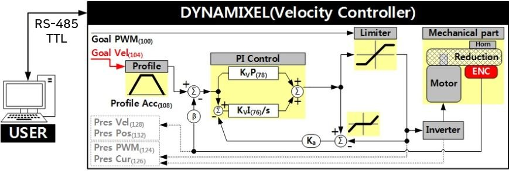

**NOTE** : Ka stands for Anti-windup Gain and β is a conversion coefficient of position and velocity that cannot be modified by users. For more details about the PID controller, please refer to the [PID Controller at wikipedia](http://en.wikipedia.org/wiki/PID_controller).

### **Position PID Gain(80, 82, 84), Feedforward 1st/2nd Gains(88, 90)**

These Gains are used in Position Control Mode and Extended Position Control Mode. Position P Gain of DYNAMIXEL’s internal controller is abbreviated to KPP and that of the Control Table is abbreviated to KPP(TBL).

|     | Controller Gain | Conversion Equations | Range | Description |
| --- | --- | --- | --- | --- |
| Position D Gain(80) | KPD | KPD = KPD(TBL) / 16 | 0 ~ 16,383 | D Gain |
| Position I Gain(82) | KPI | KPI = KPI(TBL) / 65,536 | 0 ~ 16,383 | I Gain |
| Position P Gain(84) | KPP | KPP = KPP(TBL) / 128 | 0 ~ 16,383 | P Gain |
| Feedforward 2nd Gain(88) | KFF2nd | KFF2nd(TBL) / 4 | 0 ~ 16,383 | Feedforward Acceleration Gain |
| Feedforward 1st Gain(90) | KFF1st | KFF1st(TBL) / 4 | 0 ~ 16,383 | Feedforward Velocity Gain |

Below figure is a block diagram describing the position controller in Position Control Mode and Extended Position Control Mode. When the instruction from the user is received by DYNAMIXEL, it takes following steps until driving the horn.

1.  An Instruction from the user is transmitted via DYNAMIXEL bus, then registered to [Goal Position(116)](#goal-position116).
2.  [Goal Position(116)](#goal-position116) is converted to desired position trajectory and desired velocity trajectory by [Profile Velocity(112)](#profile-velocity112) and [Profile Acceleration(108)](#profile-acceleration108).
3.  The desired position trajectory and desired velocity trajectory is stored at [Position Trajectory(140)](#position-trajectory140) and [Velocity Trajectory(136)](#velocity-trajectory136) respectively.
4.  Feedforward and PID controller calculate PWM output for the motor based on desired trajectories.
5.  [Goal PWM(100)](#goal-pwm100) sets a limit on the calculated PWM output and decides the final PWM value.
6.  The final PWM value is applied to the motor through an Inverter, and the horn of DYNAMIXEL is driven.
7.  Results are stored at [Present Position(132)](#present-position132), [Present Velocity(128)](#present-velovity128), [Present PWM(124)](#present-pwm124) and [Present Load(126)](#present-load126).

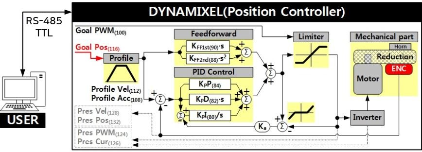

**NOTE:**

- In case of PWM Control Mode, both PID controller and Feedforward controller are deactivated while [Goal PWM(100)](#goal-pwm100) value is directly controlling the motor through an inverter. In this manner, users can directly control the supplying voltage to the motor.
- Ka is an Anti-windup Gain that cannot be modified by users.
    For more details about the PID controller and Feedforward controller, please refer to the [PID Controller](http://en.wikipedia.org/wiki/PID_controller) and [Feed Forward](https://en.wikipedia.org/wiki/Feed_forward_%28control%29).

### **[Bus Watchdog(98)](#bus-watchdog98)**
The Bus Watchdog(98) is a safety device (Fail-safe) to stops the DYNAMIXEL if the communication between the controller and DYNAMIXEL communication (RS485, TTL) is disconnected due to an unspecified error. The communication is defined as all the Instruction Packet in the DYNAMIXEL Protocol.

|     | Values | Description |
| --- | --- | --- |
| Range | 0   | Deactivate Bus Watchdog Function, Clear Bus Watchdog Error |
| Range | 1 ~ 127 | Activate Bus Watchdog (Unit: 20 \[msec\]) |
| Range | -1  | Bus Watchdog Error Status |

The Bus Watchdog function monitors the communication interval (time) between the controller and DYNAMIXEL when [Torque Enable(64)](#torque-enable64) is ‘1’(Torque ON).
If the measured communication interval (time) is larger than the set value of Bus Watchdog(98), the DYNAMIXEL will stop. Bus Watchdog(98) will be changed to ‘-1’ (Bus Watchdog Error). If the Bus Watchdog Error screen appears, the Goal Value ([Goal PWM(100)](#goal-pwm100), [Goal Velocity(104)](#goal-velocity104), [Goal Position(116)](#goal-position116)) will be changed to read-only-access. Therefore, if a new value is written to the Goal Value, the Status Packet will send the Data Range Error via its Error field. If the value of Bus Watchdog(98) is changed to ‘0’, Bus Watchdog Error will be cleared.

**NOTE** : For details of the Data Range Error, please refer to the [Protocol 2.0](https://emanual.robotis.com/docs/en/dxl/protocol2/#status-packet)

**NOTE**: Bus Watchdog (98) is available from firmware v38.

#### [Bus Watchdog (98) Example](#bus-watchdog-98-example)
The following is the example of the operation of the Bus Watchdog function.

1.  After setting the [Operating Mode(11)](#operating-mode11) to speed control mode, change the [Torque Enable(64)](#torque-enable64) to ‘1’.
2.  If ‘50’ is written in the [Goal Velocity(104)](#goal-velocity104), the DYNAMIXEL will rotate in CCW direction.
3.  Change the value of [Bus Watchdog(98)](#bus-watchdog98) to ‘100’ (2,000 \[ms\]). (Activate Bus Watchdog Function)
4.  If no instruction packet is received for 2,000 \[ms\], the DYNAMIXEL will stop. When it stops, the [Profile Acceleration(108)](#profile-acceleration108) and [Profile Velocity(112)](#profile-velocity112) are applied as ‘0’.
5.  The value of [Bus Watchdog(98)](#bus-watchdog98) changes to ‘-1’ (Bus Watchdog Error). At this time, the access to the Goal Value will be changed to read-only.
6.  If ‘150’ is written to the [Goal Velocity(104)](#goal-velocity104), the Data Range Error will be returned via Status Packet.
7.  If the value of [Bus Watchdog(98)](#bus-watchdog98) is changed to ‘0’, Bus Watchdog Error will be cleared.
8.  If “150” is written in the [Goal Velocity(104)](#goal-velocity104), the DYNAMIXEL will rotate in CCW direction.

### **[Goal PWM(100)](#goal-pwm100)**
When the [Operating Mode(11)](#operating-mode11) is **PWM Control Mode**, both the PID and Feedforward controllers will be deactivated as the Goal PWM(100) value directly controls a motor via an inverter. But on the other [Operating Mode(11)](#operating-mode11), the Goal PWM(100) limits PWM value only. Read [Position PID Gain(80, 82, 84), Feedforward 1st/2nd Gains(88, 90)](#position-pid-gain80-82-84) or [Velocity PI Gain(76, 78)](#velocity-pi-gain76-78) for how Goal PWM (100) works with the gains.

| Unit | Range |
| --- | --- |
| about 0.113 \[%\] | -[PWM Limit(36)](#pwm-limit36) ~ [PWM Limit(36)](#pwm-limit36) |

**NOTE**: Goal PWM(100) can not exceed [PWM Limit(36)](#pwm-limit36).

### **[Goal Velocity(104)](#goal-velocity104)**

Use the Goal Velocity(104) to set a desired velocity when the [Operating Mode(11)](#operating-mode11) is **Velocity Control Mode**.

Note that the Goal Velocity(104) is not used to limit moving velocity.

| Unit | Value Range |
| --- | --- |
| 0.229 rpm | -[Velocity Limit(44)](#velocity-limit44) ~ [Velocity Limit(44)](#velocity-limit44) |

**NOTE**: Goal Velocity(104) can not exceed [Velocity Limit(44)](#velocity-limit44).

**NOTE** : The maximum velocity and maximum torque of DYNAMIXEL is affected by supplying voltage.
Therefore, if supplying voltage changes, so does the maximum velocity. This manual complies with recommended supply voltage(12\[V\]).

**NOTE** : If [Profile Acceleration(108)](#profile-acceleration108) and Goal Velocity(104) are modified simultaneously, modified [Profile Acceleration(108)](#profile-acceleration108) will be used to process Goal Velocity(104).

### **[Profile Acceleration(108)](#profile-acceleration108)**

When the [Drive Mode(10)](#drive-mode) is **Velocity-based Profile**, Profile Acceleration(108) sets acceleration of the Profile.
When the [Drive Mode(10)](#drive-mode) is **Time-based Profile**, Profile Acceleration(108) sets acceleration time of the Profile.
The Profile Acceleration(108) is to be applied in all control mode except **Current Control Mode** or **PWM Control Mode** on the [Operating Mode(11)](#operating-mode11).

For more detailed information, see [What is the Profile](#what-is-the-profile)

| Velocity-based Profile | Values | Description |
| --- | --- | --- |
| Unit | 214.577 \[rev/min2\] | Sets acceleration of the Profile |
| Range | 0 ~ 32767 | ‘0’ represents an infinite acceleration |

| Time-based Profile | Values | Description |
| --- | --- | --- |
| Unit | 1 \[msec\] | Sets accelerating time of the Profile |
| Range | 0 ~ 32737 | ‘0’ represents an infinite acceleration time(‘0 \[msec\]’). Profile Acceleration(108, Acceleration time) will not exceed 50% of Profile Velocity (112, the time span to reach the velocity of the Profile) value. |

**NOTE** : Time-based Profile is available from the firmware version 42.

### **[Profile Velocity(112)](#profile-velocity112)**

When the [Drive Mode(10)](#drive-mode) is **Velocity-based Profile**, Profile Velocity(112) sets the maximum velocity of the Profile.
When the [Drive Mode(10)](#drive-mode) is **Time-based Profile**, Profile Velocity(112) sets the time span to reach the velocity (the total time) of the Profile.
Be aware that the Profile Velocity(112) is to be only applied to **Position Control Mode** or **Extended Position Control Mode** on the [Operating Mode(11)](#operating-mode11).

For more detailed information, see [What is the Profile](#what-is-the-profile).

**NOTE**: Velocity Control Mode only uses [Profile Acceleration(108)](#profile-acceleration108) without the Profile Velocity(112).

| Velocity-based Profile | Values | Description |
| --- | --- | --- |
| Unit | 0.229 \[rev/min\] | Sets velocity of the Profile |
| Range | 0 ~ 32767 | ‘0’ represents an infinite velocity |

| Time-based Profile | Values | Description |
| --- | --- | --- |
| Unit | 1 \[msec\] | Sets the time span for the Profile |
| Range | 0 ~ 32737 | ‘0’ represents an infinite velocity. Profile Acceleration(108, Acceleration time) will not exceed 50% of Profile Velocity (112, the time span to reach the velocity of the Profile) value. |

**NOTE** : Time-based Profile is available from the firmware V42.

### **[Goal Position(116)](#goal-position116)**

The Goal Position(116) sets desired position. From the front view of DYNAMIXEL, CCW is an increasing direction, whereas CW is a decreasing direction. The way of reaching the Goal Position(116) can differ by the Profile provided by DYNAMIXEL. See the [What is the Profile](#what-is-the-profile) for more details.

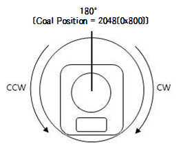

| Mode | Values | Description |
| --- | --- | --- |
| Position Control Mode | Min Position Limit(52) ~ Max Position Limit(48) | Initial Value : 0 ~ 4,095 |
| Extended Position Control Mode | -1,048,575 ~ 1,048,575 | -256\[rev\] ~ 256\[rev\] |

| Unit | Description |
| --- | --- |
| 0.088 \[deg/pulse\] | 1\[rev\] : 0 ~ 4,095 |

**NOTE** : The [Profile Velocity(112)](#profile-velocity112) and the [Profile Acceleration(108)](#profile-acceleration108) are applied in below cases.

- When the [Operating Mode(11)](#operating-mode11) is **Position Control Mode**, the [Profile Velocity(112)](#profile-velocity112) and the [Profile Acceleration(108)](#profile-acceleration108) are used to create a new profile if the [Goal Position(116)](#goal-position116) is updated.
- When the [Operating Mode(11)](#operating-mode11) is **Velocity Control Mode**, the [Profile Acceleration(108)](#profile-acceleration108) is used to create a new profile if [Goal Velocity(104)](#goal-velocity104) is updated.

**NOTE** : When turning off the power supply or changing Operation Mode on Extended Position Control Mode, the value of Present Position is reset to the absolute position value of single turn .

**NOTE** : [Present Position(132)](#present-position) represents 4 byte continuous range from -2,147,483,648 to 2,147,483,647 when Torque is turned off regardless of Operating Mode(11).
However, [Present Position(132)](#present-position) will be reset to an absolute position value within one full rotation in following cases. Note that [Present Position(132)](#present-position) value that is reset to an absolute value can differ by the set [Homing Offset(20)](#homing-offset) value.:

1.  When Operating Mode(11) switches to **Position Control Mode**, [Present Position(132)](#present-position) will be reset to an absolute position value within a full rotation.
2.  When torque is turned on in **Position Control Mode**, [Present Position(132)](#present-position) will be reset to an absolute position value within one full rotation.
3.  Turning on the power supply or using [Reboot Instruction](https://emanual.robotis.com/docs/en/dxl/protocol2/#reboot).

### **[Realtime Tick(120)](#realtime-tick120)**

The Realtime Tick(120) indicates DYNAMIXEL’s time.

| Unit | Value Range | Description |
| --- | --- | --- |
| 1 ms | 0 ~ 32,767 | The value resets to ‘0’ when it exceeds 32,767 |

### **[Moving(122)](#moving122)**

The Moving(122) indicates whether DYNAMIXEL is in motion or not.
If absolute value of [Present Velocity(128)](#present_velocity128) is greater than [Moving Threshold(24)](#moving-threshold24), Moving(122) is set to ‘1’.
Otherwise, it will be cleared to ‘0’.
However,the Moving(122) will always be set to ‘1’ regardless of [Present Velocity(128)](#present_velocity128) while Profile is in progress with [Goal Position(116)](#goal-position116) instruction.

| Value | Description |
| --- | --- |
| 0   | Movement is not detected |
| 1   | Movement is detected, or Profile is in progress(Goal Position(116) instruction is being processed) |

### **[Moving Status(123)](#moving-status123)**

The Moving Status(123), one byte data, provides additional information about the movement.
Following Error(0x08) and In-Position(0x01) are available under **Position Control Mode**, **Extended Position Control Mode**.

For more details about the mode, see the [Operating Mode(11)](#operating-mode11).

| Bit | Value | Information | Description |
| --- | --- | --- | --- |
| Bit 7 | X   | -   | Reserved |
| Bit 6 | X   | -   | Reserved |
| Bit 4 Bit 5 | 11 10 01 00 | Velocity Profile | 11 : [Trapezoidal Profile](#what-is-the-profile) 10 : Triangular Profile 01 : [Rectangular Profile](#what-is-the-profile) 00 : Profile not used([Step](#what-is-the-profile)) |
| Bit 3 | 0 or 1 | Following Error | DYNAMIXEL is following the desired position trajectory 0 : Following 1 : Not following |
| Bit 2 | X   | -   | Reserved |
| Bit 1 | 0 or 1 | Profile Ongoing | Profile is in progress with [Goal Position(116)](#goal-position116) instruction 0 : Profile completed 1 : Profile in progress |
| Bit 0 | 0 or 1 | In-Position | DYNAMIXEL has arrived to the desired position 0 : Not arrived 1 : Arrived |

**NOTE** : The Triangular velocity profile is configured when Rectangular velocity profile cannot reach to the [Profile Velocity(112)](#profile-verlocity112).

**NOTE** : In-Position bit will be set when the positional deviation is smaller than a predefined value under Position related control modes.

### **[Present PWM(124)](#present-pwm124)**

This value indicates present PWM. For more details, please refer to the [Goal PWM(100)](#goal-pwm).

### **[Present Load(126)](#present-load126)**

It means currently applied load. For example, the value is 500, it means the load is detected in the direction of CCW about 50% of the maximum torque.

| Unit | Value Range | Description |
| --- | --- | --- |
| 0.1% | -1,000 ~ 1,000 | Positive(CCW Load), Negative(CW Load) |

**NOTE** : The Present load is an inferred value based on the internal output value; not a measured value using torque sensor, etc. Therefore, it may be inaccurate for measuring weight or torque. It is recommended to use it for predicting the direction and size of the force being applied to the joint.

### **[Present Velocity(128)](#present-velocity128)**

This value indicates present Velocity. For more details, please refer to the [Goal Velocity(104)](#goal-velocity104).

### **[Present Position(132)](#present-position132)**

The Present Position(132) indicates present Position. For more details, see the [Goal Position(116)](#goal-position116).

**NOTE** : [Present Position(132)](#present-position) represents 4 byte continuous range from -2,147,483,648 to 2,147,483,647 when Torque is turned off regardless of Operating Mode(11).
However, [Present Position(132)](#present-position) will be reset to an absolute position value within one full rotation in following cases. Note that [Present Position(132)](#present-position) value that is reset to an absolute value can differ by the set [Homing Offset(20)](#homing-offset) value.:

1.  When Operating Mode(11) switches to **Position Control Mode**, [Present Position(132)](#present-position) will be reset to an absolute position value within a full rotation.
2.  When torque is turned on in **Position Control Mode**, [Present Position(132)](#present-position) will be reset to an absolute position value within one full rotation.
3.  Turning on the power supply or using [Reboot Instruction](https://emanual.robotis.com/docs/en/dxl/protocol2/#reboot).

### **[Velocity Trajectory(136)](#velocity-trajectory136)**

This is a target velocity trajectory created by Profile. Operating method can be changed based on control mode. For more details, please refer to the [Profile Velocity(112)](#profile-velocity112).

1.  **Velocity Control Mode** : When Profile reaches to the endpoint, [Velocity Trajectory(136)](#velocity-trajectory136) becomes equal to [Goal Velocity(104)](#goal-velocity104).
2.  **Position Control Mode, Extended Position Control Mode** : Velocity Trajectory is used to create [Position Trajectory(140)](#position-trajectory140). When Profile reaches to an endpoint, [Velocity Trajectory(136)](#velocity-trajectory136) is cleared to ‘0’.

### **[Position Trajectory(140)](#position-trajectory140)**

The Position Trajectory(140) is a desired position trajectory created by the [Profile](#what-is-the-profile).
The Position Trajectory(140) is used only when the [Operating Mode(11)](#operating-mode11) is **the Position Control Mode**, **Extended Position Control Mode**.
For more details, see [What is the Profile](#what-is-the-profile).

### **[Present Input Voltage(144)](#present-input-voltage144)**

The Present Input Voltage(144) indicates present voltage that is being supplied. For more details, see the [Max/Min Voltage Limit(32, 34)](#max-voltage-limit).

### **[Present Temperature(146)](#present-temperature146)**

The Present Temperature(146) indicates internal temperature of DYNAMIXEL. For more details, see the [Temperature Limit(31)](#temperature-limit31).

### **[Backup Ready(147)](#backup-ready147)**

The value in this address indicates whether the backup of the control table exists after sending the [Control Table Backup Packet](https://emanual.robotis.com/docs/en/dxl/protocol2/#control-table-backup-0x20).

| Value | Description |
| --- | --- |
| 0   | The backup data doesn’t exist. |
| 1   | A saved backup data exists. |

**NOTE**
Backup Ready is available from firmware **V45**.
See [Backup and Restore](https://emanual.robotis.com/docs/en/software/dynamixel/dynamixel_wizard2/#backup-and-restore) for more details.

### **[Indirect Address](#indirect-address)**, **[Indirect Data](#indirect-data)**

Indirect Address and Indirect Data are useful when accessing two remote addresses in the Control Table as sequential addresses. - Sequential addresses increase Instruction Packet efficiency. Addresses that can be defined as Indirect Address is limited to RAM area(Address 64 ~ 661).

- If specific address is allocated to Indirect Address, Indirect Address inherits features and properties of the Data from the specific Address.
- Property includes Size(Byte length), value range, and Access property(Read Only, Read/Write).
- For instance, allocating 65(Address of LED) to Indirect Address 1(168), Indirect Data 1(224) can perform exactly same as [LED(65)](#led65).

| Indirect Address Range | Description |
| --- | --- |
| 64 ~ 661 | [EEPROM](#control-table-of-eeprom-area) address can’t be assigned to Indirect Address |

#### [Indirect Address and Indirect Data Examples](#indirect-address-and-indirect-data-examples)

`Example 1` Allocating Size 1 byte [LED(65)](#led65) to Indirect Data 1(224).

1.  Indirect Address 1(168) : change the value to ‘65’ which is the address of LED.
2.  Set Indirect Data 1(224) to ‘1’ : LED(65) also becomes ‘1’ and LED is turned on.
3.  Set Indirect Data 1(224) to ‘0’ : LED(65) also becomes ‘0’ and LED is turned off.

`Example 2` Allocating Size 4 byte [Goal Position(116)](#goal-position116) to Indirect Data 2(225), 4 sequential bytes have to be allocated.

1.  Indirect Address 2(170) : change the value to ‘116’ which is the first address of Goal Position.
2.  Indirect Address 3(172) : change the value to ‘117’ which is the second address of Goal Position.
3.  Indirect Address 4(174) : change the value to ‘118’ which is the third address of Goal Position.
4.  Indirect Address 5(176) : change the value to ‘119’ which is the fourth address of Goal Position.
5.  Set 4 byte value ‘1,024’ to Indirect Data 2 : [Goal Position(116)](#goal-position116) also becomes ‘1024’ and DYNAMIXEL moves.

**NOTE** : In order to allocate Data in the Control Table longer than 2\[byte\] to Indirect Address, all address must be allocated to Indirect Address like the above Example 2.

**NOTE** : Indirect Address 29 ~ 56 and Indirect Data 29 ~ 56 can only be accessed with [Protocol 2.0](https://emanual.robotis.com/docs/en/dxl/protocol2/#status-packet).

## [How to Assemble](#how-to-assemble)

## [Wiring through Back Case](#wiring-through-back-case)

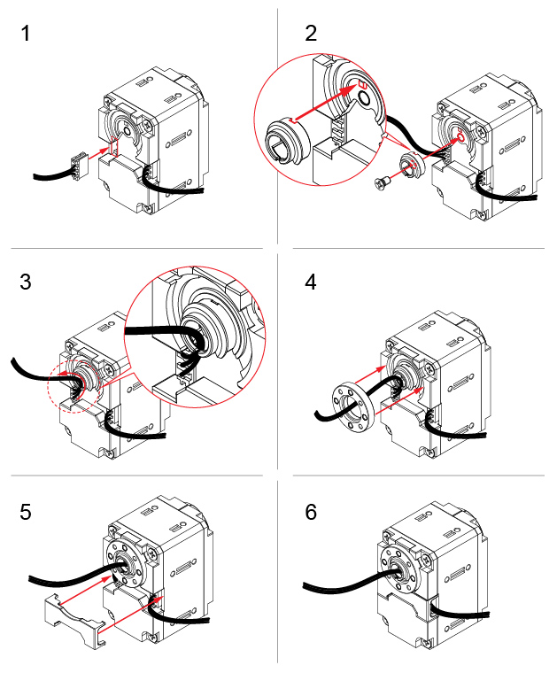

> New XL430-W250 (Released on 2018 3rd quarter)

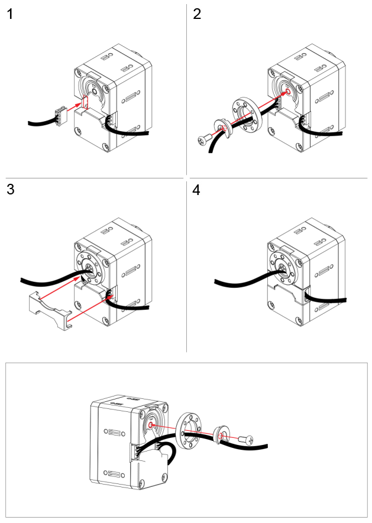

> Old XL430-W250 (This type has been discontinued)

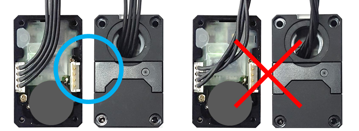

**CAUTION** : DYNAMIXEL-X series cable assembly through hollow case

- Organize the entangled cable before assembling the back case.
- Do not assemble the back case with entangled cable. The entangled cable can be squashed by the case and cause communication error.
- Do not assemble both cables through the hollow case.

## [Option Frame Assembly](#option-frame-assembly)

### New XL430-W250

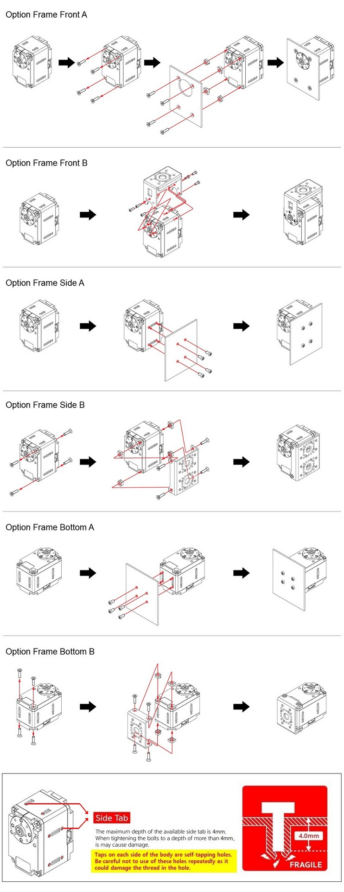

### Old XL430-W250

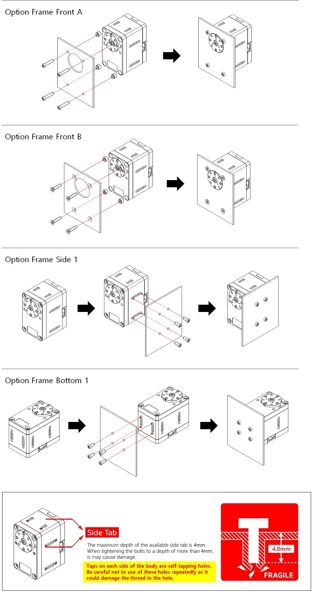

## [Reference](#reference)

## [What is the Profile](#what-is-the-profile)

The Profile is an acceleration/deceleration control method to reduce vibration, noise and load of the motor by controlling dramatically changing velocity and acceleration.
It is also called Velocity Profile as it controls acceleration and deceleration based on velocity.
DYNAMIXEL provides 3 different types of Profile. The following explains 3 Profiles.
Profiles are usually selected by the combination of [Profile Velocity(112)](#profile-velocity112) and [Profile Acceleration(108)](#profile-acceleration108).

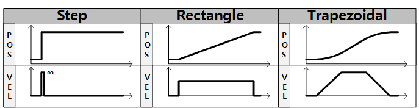

When given [Goal Position(116)](#goal-position116), DYNAMIXEL’s profile creates desired velocity trajectory based on present velocity(initial velocity of the Profile).
When DYNAMIXEL receives updated desired position from a new [Goal Position(116)](#goal-position116) while it is moving toward the previous [Goal Position(116)](#goal-position116), velocity smoothly varies for the new desired velocity trajectory.
Maintaining velocity continuity while updating desired velocity trajectory is called Velocity Override.
For a simple calculation, let’s assume that the initial velocity of the Profile is ‘0’.
The following explains how Profile processes [Goal Position(116)](#goal-position116) instruction in Position Control mode, Extended Position Control Mode.

1.  An Instruction from the user is transmitted via DYNAMIXEL bus, then registered to [Goal Position(116)](#goal-position116) (If Velocity-based Profile is selected).
2.  Acceleration time(t1) is calculated from [Profile Velocity(112)](#profile-velocity112) and [Profile Acceleration(108)](#profile-acceleration108).
3.  Types of Profile is decided based on [Profile Velocity(112)](#profile-velocity112), [Profile Acceleration(108)](#profile-acceleration108) and total travel distance(ΔPos, the distance difference between desired position and present position).
4.  Selected Profile type is stored at [Moving Status(123)](#moving-status123).
5.  DYNAMIXEL is driven by the calculated desired trajectory from Profile.
6.  desired velocity trajectory and desired position trajectory from Profile are stored at [Velocity Trajectory(136)](#velocity-trajectory136) and [Position Trajectory(140)](#position-trajectory140) respectively.

| Condition | Types of Profile |
| --- | --- |
| VPRFL(112) = 0 | Profile not used (Step Instruction) |
| (VPRFL(112) ≠ 0) & (APRF(108) = 0) | Rectangular Profile |
| (VPRFL(112) ≠ 0) & (APRF(108) ≠ 0) | Trapezoidal Profile |

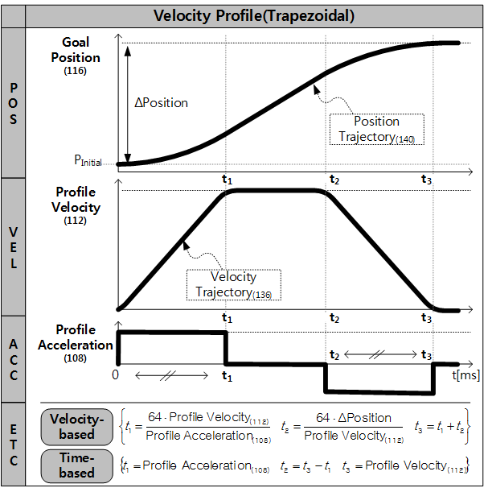

**NOTE** : Velocity Control Mode only uses [Profile Acceleration(108)](#profile-acceleration108). Step and Trapezoidal Profiles are supported. Velocity Override are supported as well. Acceleration time(t1) can be calculated as below equation.

**Velocity-based Profile** : t1 = 64 * {[Profile Velocity(112)](#profile-velocity112) / [Profile Acceleration(108)](#profile-acceleration108)}
**Time-based Profile** : t1 = [Profile Acceleration(108)](#profile-acceleration108)

**NOTE** : If Time-based Profile is selected, [Profile Velocity(112)](#profile-velocity112) is used to set the time span of the Profile(t3), while [Profile Acceleration(108)](#profile-acceleration108) sets accelerating time(t1) in millisecond\[ms\]. [Profile Acceleration(108)](#profile-acceleration108) will not exceed 50% of [Profile Velocity(112)](#profile-velocity112) value.

## [Certifications](#certifications)

Please inquire us for information regarding unlisted certifications.

### [FCC](#fcc)

**Note**: This equipment has been tested and found to comply with the limits for a Class B digital device, pursuant to part 15 of the FCC Rules. These limits are designed to provide reasonable protection against harmful interference in a residential installation. This equipment generates, uses and can radiate radio frequency energy and, if not installed and used in accordance with the instructions, may cause harmful interference to radio communications. However, there is no guarantee that interference will not occur in a particular installation. If this equipment does cause harmful interference to radio or television reception, which can be determined by turning the equipment off and on, the user is encouraged to try to correct the interference by one more of the following measures:

- Reorient or relocate the receiving antenna.
- Increase the separation between the equipment and receiver.
- Connect the equipment into an outlet on a circuit different from that to which the receiver is connected.
- Consult the dealer or an experienced radio/TV technician for help.

**WARNING**
Any changes or modifications not expressly approved by the manufacturer could void the user’s authority to operate the equipment.

## [Quick Start](#quick-start)

### Prerequisites

- Power supply to DYNAMIXEL(12V SMPS / Controllers, compatible with DYNAMIXEL or [LB-020 battery](http://en.robotis.com/shop_en/item.php?it_id=903-0277-000))
    - See [Compatibility Table](https://emanual.robotis.com/docs/en/parts/controller/controller_compatibility/#compatibility-table/#compatibility-table)
- PC with Windows, Linux or MacOS.
- Connection between PC and DYNAMIXEL ([U2D2](https://emanual.robotis.com/docs/en/parts/interface/u2d2/), [USB2Dynamixel](https://emanual.robotis.com/docs/en/parts/interface/usb2dynamixel/))
- [Compatible Software with DYNAMIXEL](#compatible-software-with-dynamixel)

**WARNING**:

- USB2Dynamixel has been discontinued.
- Some software may not support OS which you use. Be sure to read e-Manual of software you use to check the supported OS for right use of software.

**NOTE**:

- U2D2 is a small size USB communication converter that enables to control and operate DYNAMIXEL with PC.
- [U2D2 Power Hub](https://emanual.robotis.com/docs/en/parts/interface/u2d2_power_hub/) which combines with U2D2 supplies a variety external power source with a stable power supply to DYNAMIXEL.

### [Compatible Software with DYNAMIXEL](#compatible-software-with-dynamixel)

You can use exclusive software for DYNAMIXEL. See the software compatibility on the next table and choose a desired software for your project.

| Model | AX Series | DX Series | RX Series | EX Series | MX Series | X-Series | PRO Series | P Series |
| --- | --- | --- | --- | --- | --- | --- | --- | --- |
| R+ Manager 2.0 | X   | X   | X   | X   | O   | O   | O   | O   |
| DYNAMIXEL Wizard | O   | X   | X   | O   | O   | X (XL320 can be used) | O   | X   |
| DYNAMIXEL Wizard 2.0 | O   | O   | O   | O   | O   | O   | O   | O   |
| DYNAMIXEL SDK | O   | O   | O   | O   | O   | O   | O   | O   |
| DYNAMIXEL Workbench | O   | O   | O   | O   | O   | O   | O   | O   |

#### [R+ Manager](#r-manager)

[R+ Manager](https://emanual.robotis.com/docs/en/software/rplus1/manager/) is used to handle devices used by a robot. Major functions of this program are as follows.

- Manage controller firmware. (Update and Restore)
- Inspect the status of the controller and peripheral devices. (Test)
- Set the required modes. (Settings)

**NOTE**: R+ Manager 2.0 or DYNAMIXEL Wizard 2.0 provides diverse features compared to [R+ Manager](https://emanual.robotis.com/docs/en/software/rplus1/manager/).

#### [R+ Manager 2.0](#r-manager-20)

The R+ Manager 2.0 manages a controller and DYNAMIXEL devices that comprise the robot. By connecting the product, you can update the product to the latest version and test Control Table. The functions that were previously provided in RoboPlus Manager 1.0 and Wizard 1.0 have been combined in RoboPlus Manager 2.0.

**WARNING**: R+ Manager 2.0 is not compatible with DYNAMIXEL using protocol 1.0.
DYNAMIXEL Wizard 2.0 supports all DYNAMIXEL for Firmware Recovery, Firmware Update, and change data of Control Table of DYNAMIXEL.

#### [DYNAMIXEL Wizard 2.0](#dynamixel-wizard-20)

[DYNAMIXEL Wizard 2.0](https://emanual.robotis.com/docs/en/software/dynamixel/dynamixel_wizard2/) is an optimized tool for managing DYNAMIXEL’s from various operating systems.

The following features are provided with DYNAMIXEL Wizard 2.0.

- DYNAMIXEL Firmware Update
- DYNAMIXEL Diagnosis
- DYNAMIXEL Configuration and Test
- DYNAMIXEL Data Plotting in Real-Time
- Generate & Monitor DYNAMIXEL Packets

#### [DYNAMIXEL SDK](#dynamixel-sdk)
[DYNAMIXEL SDK](https://emanual.robotis.com/docs/en/software/dynamixel/dynamixel_sdk/overview/) is a software development kit that provides DYNAMIXEL control functions using packet communication. The API of DYNAMIXEL SDK is designed for DYNAMIXEL actuators and DYNAMIXEL-based platforms. You need to be familiar with C/C++ programming language for right use of the software. This e-Manual provides comprehensive information on ROBOTIS products and applications.

**Supported Programming Laguanges and Features**:
- C, C++, C#, Python, Java, MATLAB, LabVIEW
- Windows, Mac, Linux.
- ROS
- Arduino

#### [DYNAMIXEL Workbench](#dynamixel_workbench)

[DYNAMIXEL Workbench](https://emanual.robotis.com/docs/en/software/dynamixel/dynamixel_workbench/), based on DYNAMIXEL SDK, is library which provides simple and easier method to use DYNAMIXEL.

**Supported Programming Laguanges and Features**:

- C++
- Linux, MacOS
- ROS
- Arduino

**NOTE**: DYNAMIXEL Workbench may provide lack of contents or features compared to DYNAMIXEL SDK. In order to use DYNAMIXEL with sufficient contents, use [DYNAMIXEL SDK](https://emanual.robotis.com/docs/en/software/dynamixel/dynamixel_sdk/overview/).

## [Connector Information](#connector-information)

## [Communication Circuit](#communication-circuit)

To control the DYNAMIXEL actuators, the main controller needs to convert its UART signals to the half duplex type. The recommended circuit diagram for this is shown below.

### [TTL Communication](#ttl-communication)

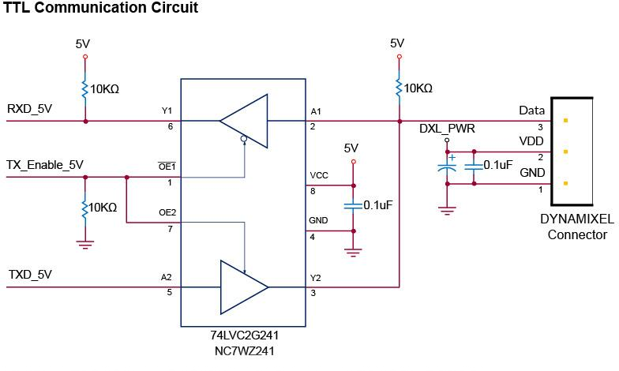

**NOTE**: Above circuit is designed for 5V or 5V tolerant MCU. Otherwise, use a Level Shifter to match the voltage of MCU.

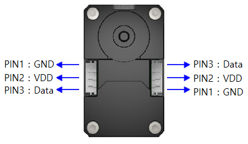

## [Drawings](#drawings)

### New XL430-W250

- `Download` [XL430_new(pdf).pdf](http://www.robotis.com/service/download.php?no=772)
- `Download` [XL430_new(dwg).dwg](http://www.robotis.com/service/download.php?no=771)
- `Download` [XL430_new(stp).stp](http://www.robotis.com/service/download.php?no=773)

### Old XL430-W250

# Ссылки:
- https://emanual.robotis.com/docs/en/dxl/x/xl430-w250/#specifications
- Please also checkout **[ROBOTIS Download Center](http://en.robotis.com/service/downloadpage.php?ca_id=70)** for software applications, 3D/2D CAD, and other useful resources!
